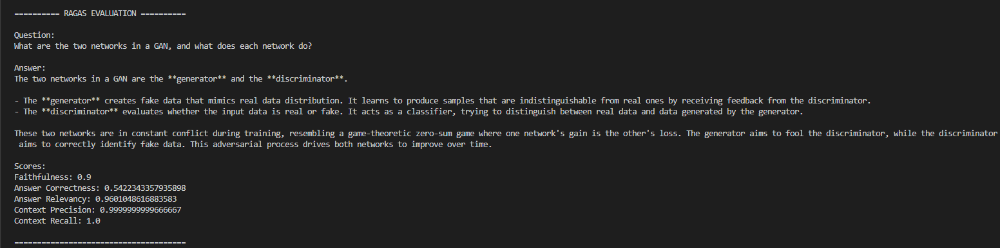

# Document Research Assistant 
 
A RAG-based AI Document Research Assistant that allows users to provide a research paper in PDF format and ask questions about its content. 
 
## Tech Stack 
 
- Python 
- LangChain 
- Hugging Face 
- FAISS 
- PyPDF 
- RAG 
- RAGAS 
 
## How It Works 
 
PDF → Text Extraction → Chunking → Embeddings → FAISS → Retrieval → Prompt → LLM → Answer 
 
## Example 
 
The user provides a research paper and asks: 
 
> What are the different types of GANs? 
 
The assistant retrieves relevant information from the document and generates an answer using the LLM. 
 
For questions unrelated to the document: 
 
> When is NASA going to space next? 
 
The assistant responds: 
 
> I couldn't find the answer in the provided document. 
 
## RAG Evaluation 
 
The RAG pipeline is evaluated using **RAGAS** with the following metrics: 
 
- Faithfulness 
- Answer Relevancy 
- Answer Correctness 
- Context Precision 
- Context Recall 
 
### V1 Evaluation 
 
 
 
## Project Structure

```text
DOCUMENT_RESEARCH_ASSISTANT/

app/
    main.py

documents/
    research_paper.pdf

evaluations/
    evaluate.py
    v1_ragas_evaluation.png

README.md
.gitignore
requirements.txt
.env