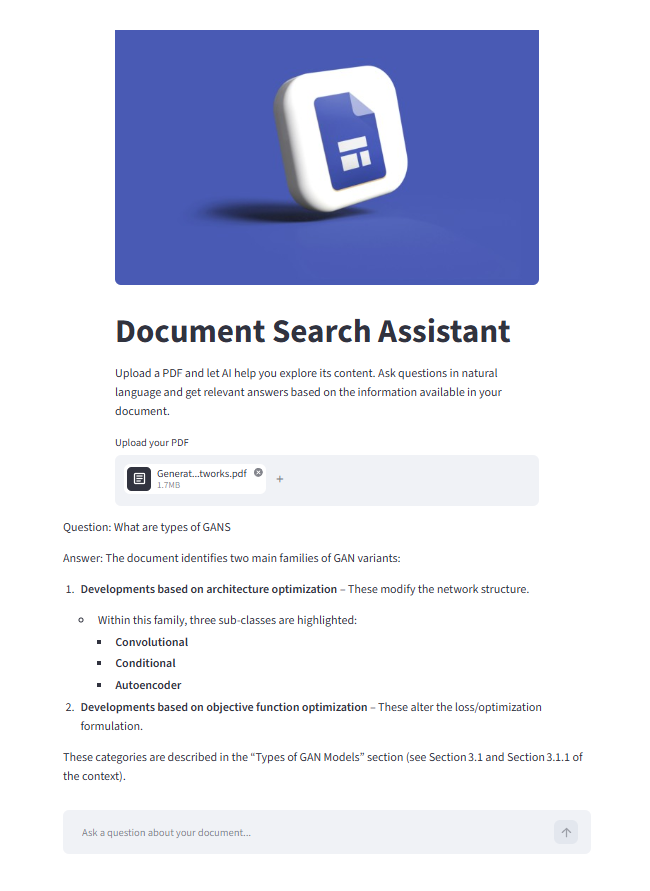
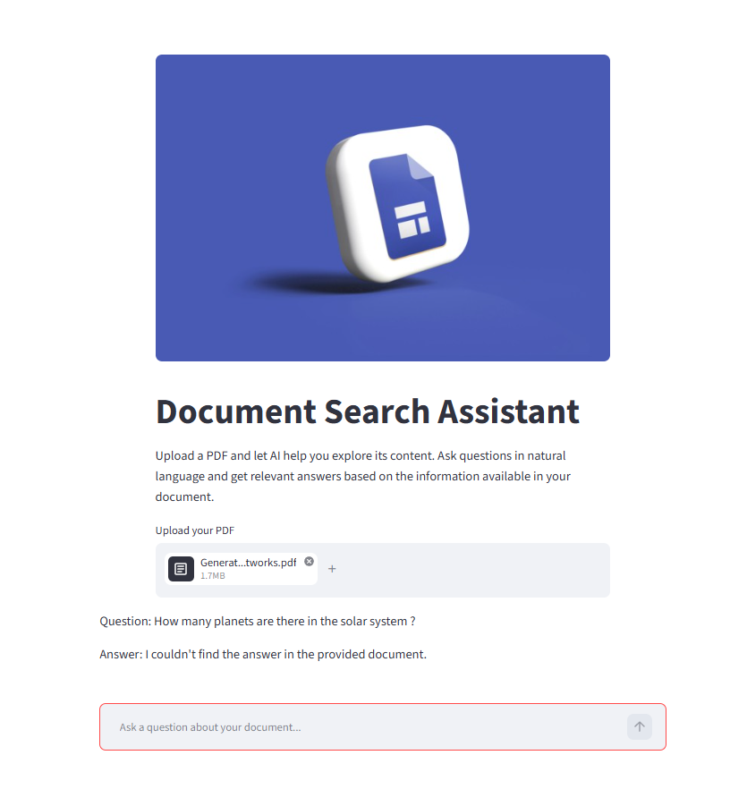
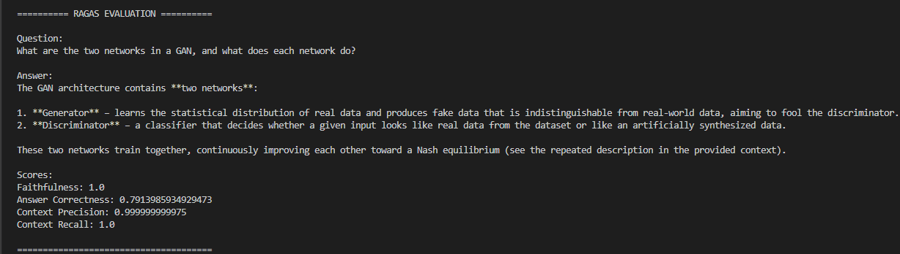

# Document Search Assistant

A RAG-based AI Document Search Assistant that allows users to upload a PDF document and ask questions about its content.

[Live Demo](https://document-search-assistant.streamlit.app/)

## Tech Stack

- Python
- LangChain
- Groq
- Cohere
- ChromaDB
- Streamlit
- PyPDF
- RAG
- RAGAS
- Docker

## How It Works

PDF → Text Extraction → Chunking → Cohere Embeddings → ChromaDB → Retrieval → Prompt → Groq LLM → Answer

## Example

The user uploads a research paper and asks:

> What are the two networks in a GAN, and what does each network do?

The assistant retrieves relevant information from the document and generates an answer using the Groq LLM.

For questions unrelated to the document:

> How many planets are there in the solar system ?

The assistant responds:

> I couldn't find the answer in the provided document.

## Application Preview

### Preview 1



### Preview 2



## RAG Evaluation

The RAG pipeline is evaluated using **RAGAS** with the following metrics:

- Faithfulness
- Answer Correctness
- Context Precision
- Context Recall

### RAGAS Evaluation Results



## Project Structure

```text
DOCUMENT_SEARCH_ASSISTANT/

src/
    __init__.py
    document_logo.jpg
    main.py
    ui.py

documents/

evaluations/
    evaluate.py
    preview_1.png
    preview_2.png
    ragas_evaluation.png

.dockerignore
.gitignore
Dockerfile
README.md
requirements.txt